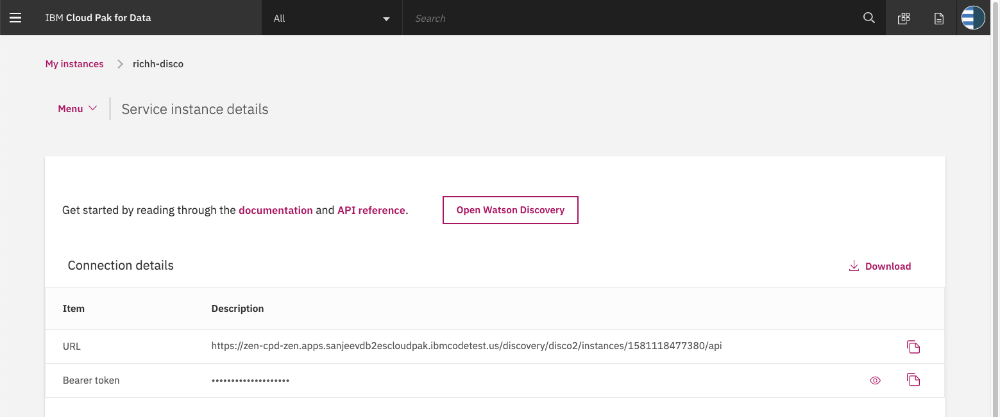

# ca-assets
Assets for Cognos Analytics project

This requires an IBM Cloud Pak for Data cluster, and the following services:

* Watson Discovery
* Db2 Warehouse

## Steps

1. [Clone the repo](#1-clone-the-repo)
1. [Create your services on IBM Cloud Pak for Data](#2-create-your-services-on-ibm-cloud-pak-for-data)
1. [Configure Watson Discovery](#3-configure-watson-discovery)
1. [Configure Db2 Warehouse](#4-configure-db2-warehouse)
1. [Add service credentials to environment file](#5-add-service-credentials-to-environment-file)
1. [Run scripts to generate data](#6-run-scripts-to-generate-data)

## 1. Clone the repo

```bash
git clone https://github.com/rhagarty/ca-assets.git
```

## 2. Create your services on IBM Cloud Pak for Data

Create the following services:

* **Watson Discovery**
* **Db2 Warehouse**

Use the following instructions for each of the services.

### Install and provision service instances

The services are not available by default. An administrator must install them on the IBM Cloud Pak for Data platform, and you must be given access to the service. To determine whether the service is installed, Click the <b>Services</b> icon () and check whether the service is enabled.

## 3. Configure Watson Discovery

### Launch Discovery

Find the Discovery service in your list of `Provisioned Instances` in your IBM Cloud Pak for Data Dashboard.

Click on `View Details` from the options menu associated with your Discovery service.

  

Click on `Open Watson Discovery`.

  

### Create a project and collection

Create a new project by clicking the `New Project` tile.

Give the project a unique name and select the `Document Retrieval` option, then click `Next`.

For data source, click on the `Upload data` tile and click `Next`.

Enter a unique name for your collection and click `Finish`.

> **NOTE**: on IBM Cloud Pak for Data, Discovery service queries are defaulted to be performed on all collections within a project. For this reason, it is advised that you create a new project to contain the collection we will be creating for this code pattern.

### Load the product review files

On the `Configure Collection` panel, click the `Select documents` button to select all 1000 json review files located in the `data` directory of your local repo.

Be patient as this process make take several minutes.

### Access the collection

To access the collection, make sure you are in the correct project, then click the `Manage Collections` tab in the left-side of the panel.

  

Click the collection tile to access it.

  

## 4. Configure Db2 Warehouse

NEED TO ADD

## 5. Add service credentials to environment file

Next, you'll need to add the Watson Discovery and Db2 Warehouse credentials to the .env file.

### 1. From the home directory of your cloned local repo, create a .env file by copying it from the sample version.

```bash
cp env.sample .env
```

### 2. Collect IBM Cloud Pak for Data credentials

* Create a user to use for authentication. From the IBM Cloud Pak for Data main navigation menu (☰), select `Administer > Manage users` and then `+ New user`.

* From the main navigation menu (☰), select `My instances`.

* On the `Provisioned instances` tab, find your service instance, and then hover over the last column to find and click the ellipses icon. Choose `View details`.

* Copy the `URL` to use as the `{SERVICE_NAME}_URL` when you configure credentials.

* Use the `Menu` and select `Users` and `+ Add user` to grant your user access to this service instance. This is the user name (and password) you will enter into your `.env` file.

### 3. Collect Watson Discovery project ID

* From your Watson Discovery service instance, click on your project.

* From the main navigation menu (☰), select `Integrate and deploy`, and then click on the `View API Information` tab.

  

* Copy the `Project ID` to enter into your `.env` file.

### 4. Collect Db2 Warehouse DSN

NEED TO ADD

### 5. Edit the `.env` file with the necessary credentials and settings

#### `env.sample:`

```bash
# Copy this file to .env and replace the credentials with
# your own before starting the app.

# Watson Discovery
DISCOVERY_AUTH_TYPE=cp4d
DISCOVERY_AUTH_URL=https://my-cpd-cluster.ibmcodetest.us
DISCOVERY_USERNAME=my-username
DISCOVERY_PASSWORD=my-password
DISCOVERY_URL=https://my-cpd-cluster.ibmcodetest.us/assistant/assistant/instances/1576274722862/api
# # If you use a self-signed certificate, you need to disable SSL verification.
# # This is not secure and not recommended.
#DISCOVERY_AUTH_DISABLE_SSL=true
#DISCOVERY_DISABLE_SSL=true
DISCOVERY_PROJECT_ID=<add_project_id>

# Db2 Warehouse access
DB2WH_DSN='<add_db2_warehouse_instance'

# Optional settings
WRITE_TO_CSV_FILE=true
WRITE_TO_DB=true
```

## 6. Run scripts to generate data

The provided scripts can be used to generate sample data for a facticious company, Named "Golden Cereals". The company offers 10 types of cereal, which is sold in grocery stores. Product inventory is stored in multiple warehouses, which the company continuosly stocks.

The scripts build the following data, which will be output to local .csv files, and also to Db2 Warehouse tables.

* Products - this is information about each of our products. Includes product_id, name, and unit price.
* Stores - this is information about each of our stores. Includes store_id and location.
* Sales - this is the sales data from each of the stores. Includes store_id, product_id, data, and amount of items sold.
* Orders - this is orders generated by our stores. Includes store_id, product_id, date, and number of items.
* Warehouses - this is information about each of our warehouses, which are used to supply our stores with product. Includes warehouse_id, the amout of each product, and the amount of product that comes in on a monthly basis.

Flow:

* `Golden Cereals` stocks it's warehouses with products
* Stores orders the products and sells to customers
* Stores make additional orders as more products are sold
* `Golden Cereals` fulfills store orders by shipping products from their warehouses
* `Golden Cereals` re-stocks the warehouses as inventory drops

To run the script you will need to install [Node.js](https://nodejs.org/), an open-source JavaScript run-time environment for executing server-side JavaScript code.

```bash
cd ca-assets/scripts
node GenerateAndSaveData
```

### Additional scripting information

Outside of the scripts used to build the product and sales data listed above, there are additonal scripts which were used to generate product review data. The end result of the scripts is the generation of 1000 food review json files that can be loaded into Watson Discovery (see [Step #3](#3-configure-watson-discovery)). Since we have included the 1000 json files in this repo, there is no need to run the scripts again, but it is worth discussing how they work.

#### scripts/csv-find-product-with-most-reviews.js

1. Download Amazon food review data from [Kaggle](https://www.kaggle.com/snap/amazon-fine-food-reviews).
1. Save as local file `data/Reviews-full.csv`.
1. Process all reviews and log the number of reviews per product, along with how useful each review is based on `helpfullness factor`.
1. Print out the list of products in order of useful reviews.

#### scripts/csv-to-json.js

1. Use the top 10 reviews determined by `csv-find-product-with-most-reviews`.
1. Cut and paste the product ID of the top 10 products.
1. Add a more user-readable product ID for each.
1. Process all reviews in `data/Reviews-full.csv`, and only process the top 100 useful reviews for the products we have identified.
1. Create a json file for each review and store it in the `data/food_reviews` directory.

> **Note**: The actual review dates were spread out from 2008-20017. In order to make the data more relevant to our needs, we modified all dates to be in 2019.

## 7. Run Cognos Analytics to visualize data

TO BE ADDED
 
# License

This code pattern is licensed under the Apache Software License, Version 2.  Separate third party code objects invoked within this code pattern are licensed by their respective providers pursuant to their own separate licenses. Contributions are subject to the [Developer Certificate of Origin, Version 1.1 (DCO)](https://developercertificate.org/) and the [Apache Software License, Version 2](https://www.apache.org/licenses/LICENSE-2.0.txt).

[Apache Software License (ASL) FAQ](https://www.apache.org/foundation/license-faq.html#WhatDoesItMEAN) 
